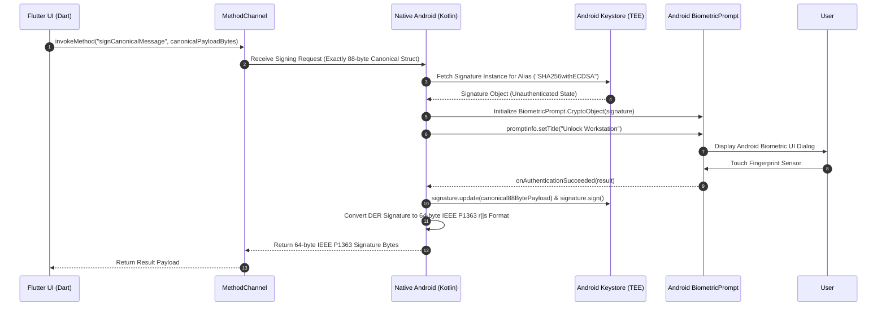

# MobileFingerprintUnlock — Android Security & Biometric Specification

## 1. Hardware-Backed Android Keystore Integration

The Android mobile application relies on the **Android Keystore System** to create and isolate asymmetric ECDSA P-256 key pairs within the device's Trusted Execution Environment (TEE) or dedicated security chip (StrongBox).

### Key Pair Generation Parameters

```kotlin
// Android Native Kotlin Implementation Guide
val keyPairGenerator = KeyPairGenerator.getInstance(
    KeyProperties.KEY_ALGORITHM_EC, 
    "AndroidKeyStore"
)

val keyGenParameterSpec = KeyGenParameterSpec.Builder(
    KEY_ALIAS_DEVICE_IDENTITY,
    KeyProperties.PURPOSE_SIGN or KeyProperties.PURPOSE_VERIFY
)
    .setAlgorithmParameterSpec(ECGenParameterSpec("secp256r1"))
    .setDigests(KeyProperties.DIGEST_SHA256)
    .setUserAuthenticationRequired(true) // Requires biometric/PIN
    .setUserAuthenticationParameters(0, KeyProperties.AUTH_BIOMETRIC_STRONG)
    .setInvalidatedByBiometricEnrollment(true) // Invalidate if new fingerprint added
    .setIsStrongBoxBacked(context.packageManager.hasSystemFeature(PackageManager.FEATURE_STRONGBOX_KEYSTORE))
    .build()

keyPairGenerator.initialize(keyGenParameterSpec)
keyPairGenerator.generateKeyPair()
```

---

## 2. BiometricPrompt & CryptoObject Integration Flow



---

## 3. Approved Android Storage Architecture

> [!IMPORTANT]
> **Deprecation Notice & Mandatory Replacement**: `EncryptedSharedPreferences` (part of Jetpack Security) is **DEPRECATED** in current Android documentation due to initialization deadlocks and memory corruption bugs. **MobileFingerprintUnlock DOES NOT USE `EncryptedSharedPreferences`**.

### Standard Storage Strategy

1. **Non-Secret Application Data**: Standard Android `SharedPreferences` or SQLite database via Flutter `shared_preferences` / `sqflite` plugin. Stores paired PC list, display names, IP hostnames, port numbers, and UI preferences.
2. **Private Cryptographic Keys**: Android Keystore hardware memory (`AndroidKeyStore` provider). Keys never enter software application storage.
3. **Sensitive Local Config Encryption (If Needed)**: Where application settings require encryption, the app uses standard `Cipher.getInstance("AES/GCM/NoPadding")` with an AES-256 key initialized in Android Keystore, persisted to local app storage using standard file APIs.

---

## 4. Flutter Platform Channels Specification

Flutter Dart components communicate with native Android Kotlin code via a strongly-typed `MethodChannel`:

```dart
// Dart Channel Definition
static const String CHANNEL_NAME = 'com.mobileunlock.security/biometrics';
static const MethodChannel _channel = MethodChannel(CHANNEL_NAME);

Future<Uint8List?> signCanonicalMessage(Uint8List canonicalPayload88Bytes) async {
  assert(canonicalPayload88Bytes.length == 88, 'Canonical SignedMessage must be exactly 88 bytes');
  try {
    final Uint8List signatureBytes = await _channel.invokeMethod('signCanonicalMessage', {
      'payload': canonicalPayload88Bytes,
    });
    return signatureBytes; // Returns 64-byte IEEE P1363 (r||s) signature
  } on PlatformException catch (e) {
    // Handle BIOMETRIC_CANCELLED, BIOMETRIC_FAILED, KEY_INVALIDATED
    return null;
  }
}
```

---

## 5. Root, Emulator & Tamper Detection Guidelines

To prevent execution inside compromised or instrumented environments:
1. **StrongBox Preference**: Preference is given to hardware StrongBox modules (`setIsStrongBoxBacked(true)`).
2. **Emulator Check**: Detects generic Android emulators (`Build.FINGERPRINT.startsWith("generic")`, `Build.HARDWARE.contains("goldfish")`).
3. **Biometric Integrity**: `setInvalidatedByBiometricEnrollment(true)` guarantees that if an attacker adds a rogue fingerprint to an unlocked device, existing unlock keys are permanently rendered useless.
