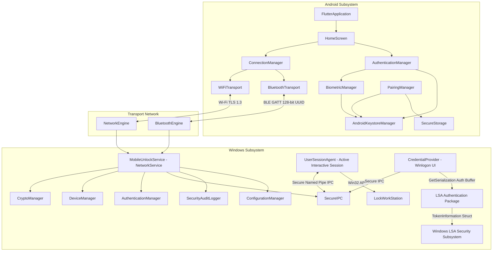
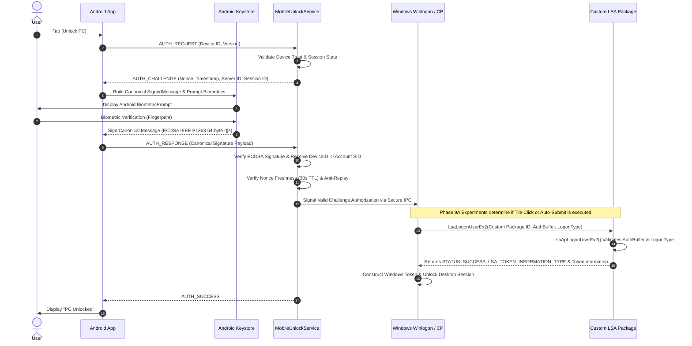
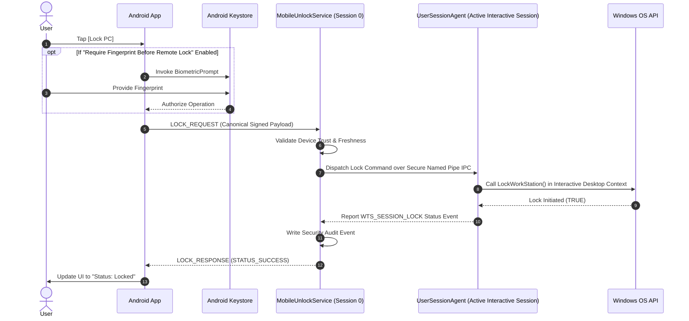

# MobileFingerprintUnlock — System Architecture Specification

## 1. Executive Summary & Core Security Guarantees

**MobileFingerprintUnlock** is a secure, enterprise-grade authentication and remote control system enabling a trusted Android mobile device to authorize unlock operations and remotely lock a Microsoft Windows workstation.

### Fundamental Security Postulate
- **Zero Fingerprint Transmission**: Biometric data **NEVER** leaves the Android device's hardware security module (TEE/StrongBox).
- **Zero Password Storage / Transmission**: No Windows user passwords are stored on the phone, sent across any network, or cached in insecure memory.
- **No Windows Security Bypasses**: Authentication strictly follows official Windows Logon architecture via an integrated **Credential Provider** and a custom **LSA Authentication Package**.
- **UserSessionAgent Isolation**: Remote workstation locking is performed by `UserSessionAgent.exe` running within the currently active interactive user session identified using Windows session/WTS APIs.

---

## 2. Primary Windows Authentication Architecture

The system enforces a **single unified authentication flow** for workstation unlocking:

```
+--------------------------+
|  Android Phone           |  Local Biometric Prompt -> Keystore Signing
+--------------------------+
             | Canonical Signed Message Payload (ECDSA P-256 IEEE P1363)
             v
+--------------------------+
|  Windows Network Engine  |  MobileUnlockService (NetworkService Context)
+--------------------------+
             | Validated Request / Challenge Token via Secure IPC
             v
+--------------------------+
| Windows Credential       |  Winlogon UI Context
| Provider                 |  Serializes custom authentication buffer via GetSerialization
+--------------------------+
             | LsaLogonUser() RPC Call with Custom Package ID
             v
+--------------------------+
| Custom LSA               |  Runs inside LSASS.exe (TCB)
| Authentication Package   |  Invokes LsaApLogonUserEx2
+--------------------------+
             | Validates Canonical Signature, Nonce & Maps DeviceID -> Account SID
             v
+--------------------------+
| LSA Token Information    |  Returns LSA_TOKEN_INFORMATION_TYPE & TokenInformation
+--------------------------+
             | Windows LSA constructs authentic user token
             v
+--------------------------+
| Windows Logon / Unlock   |  Winlogon unlocks desktop session
+--------------------------+
```

---

### Rejected Alternatives

The following architectures were explicitly evaluated and **REJECTED**:

| Rejected Alternative | Reason for Rejection |
| :--- | :--- |
| **Direct Service Call to `LockWorkStation()`** | Service runs in Session 0; `LockWorkStation()` fails or does not lock interactive desktop sessions. |
| **Phone Choosing Target Windows SID** | Device ID must be resolved on Windows side (`HKLM\SOFTWARE\MobileFingerprintUnlock\Devices`) to prevent SID spoofing. |
| **Simulated Keyboard / Password Injection** | Violates zero-password principle; vulnerable to keyloggers and focus-stealing. |
| **UI Automation / Simulated Ctrl+Alt+Del** | Fragile, insecure, easily bypassed, prohibited by Windows security guidelines. |
| **MSV1_0 / Kerberos Delegation Claims** | Incorrect architecture; custom LSA package directly provides token information structures to LSA. |
| **Credential Provider Storing Plaintext Password** | Insecure; credential buffers in memory can be dumped by local administrative processes. |

---

## 3. Subsystem Architecture & Component Breakdown

### 3.1 Windows Subsystem Components (16 Components)

1. **`MobileUnlockService`**: Core Windows Service (`NetworkService` context). Manages system state machine, network listeners, and IPC dispatch.
2. **`NetworkEngine`**: Manages TCP/TLS 1.3 socket server for Wi-Fi communication and mDNS service registration (`_mobileunlock._tcp`).
3. **`BluetoothEngine`**: Manages Bluetooth Low Energy (BLE) GATT service registration using custom 128-bit UUIDs.
4. **`PairingManager`**: Handles out-of-band trust establishment, PIN verification, public key exchange, and registry persistence.
5. **`CryptoManager`**: C++ wrapper around Windows CNG (`BCrypt` APIs) for ECDSA P-256 signature verification (raw IEEE P1363 `r||s`), SHA-256 digests, and `BCryptGenRandom`.
6. **`DeviceManager`**: Manages trusted mobile device identities, public keys, and revocation lists in `HKLM\SOFTWARE\MobileFingerprintUnlock\Devices`.
7. **`AuthenticationManager`**: Validates incoming canonical signed messages, nonces, freshness (30s TTL), and anti-replay sequence windows.
8. **`SecureIPC`**: Secure Named Pipe communication (`\\.\pipe\MobileUnlockSecureIPC`) between Service, Credential Provider, and UserSessionAgent.
9. **`CredentialProvider`**: Windows Credential Provider v2 DLL (`ICredentialProvider`, `ICredentialProviderCredential`) integrated with `Winlogon`.
10. **`LSAAuthenticationPackage`**: Custom LSA Authentication Package DLL (`LsaApInitializePackage`, `LsaApLogonUserEx2`) loaded into `lsass.exe`.
11. **`UserSessionAgent`**: Interactive user-session application (`UserSessionAgent.exe`). Runs in the currently active interactive user session identified using Windows session/WTS APIs, calls `LockWorkStation()`, and reports WTS session state (`WTS_SESSION_LOCK`/`UNLOCK`).
12. **`ConfigurationManager`**: Manages settings under `HKLM\SOFTWARE\MobileFingerprintUnlock\Settings`, port bindings, and operational flags.
13. **`SecurityAuditLogger`**: Writes structured security events to Windows Security Event Log under Source `MobileFingerprintUnlock`.
14. **`Installer`**: Windows Installer / PowerShell deployment script registering LSA package, Credential Provider, and Windows Service.
15. **`DiagnosticManager`**: Provides health checks, connectivity status, self-tests, and troubleshooting telemetry to administrators.
16. **`UpdateManager`**: Validates signed binary updates and applies service/provider patches securely.

---

### 3.2 Android Subsystem Components (15 Components)

1. **`FlutterApplication`**: Flutter app entry point managing UI navigation, global theme, and dependency injection.
2. **`HomeScreen`**: Displays active PC connection status, lock state, quick action buttons (`Unlock`, `Lock PC`), and paired status.
3. **`DeviceDiscovery`**: Scans local Wi-Fi (mDNS / UDP broadcast) and BLE advertisements for Windows PC targets.
4. **`ConnectionManager`**: Orchestrates active transport selection (Wi-Fi vs BLE vs Internet Relay) and automatic fallback.
5. **`WiFiTransport`**: Manages TLS 1.3 client socket connection over local Wi-Fi TCP network.
6. **`BluetoothTransport`**: Handles BLE GATT client profile interaction using custom 128-bit UUIDs and RSSI proximity checks.
7. **`PairingManager`**: Executes pairing flow, SAS (Short Authentication String) presentation, and public key generation.
8. **`AuthenticationManager`**: Coordinates unlock requests: builds canonical signed message, invokes BiometricManager, sends response.
9. **`BiometricManager`**: Integrates with Android `BiometricPrompt` API to authenticate user biometrically.
10. **`AndroidKeystoreManager`**: Generates and stores ECDSA P-256 key pairs in hardware-backed Android Keystore (`KeyProperties.PURPOSE_SIGN`).
11. **`SecureStorage`**: Encrypts non-secret local settings and paired device metadata (using Android Keystore AES-256 key).
12. **`NotificationManager`**: Displays status notifications and prompt alerts for incoming lock/unlock actions.
13. **`DeviceManager`**: Manages paired PC list, public key fingerprints, custom display names, and unpair controls.
14. **`SettingsManager`**: Manages app options ("Require fingerprint before remote lock", preferred transport, auto-connect).
15. **`SecurityEventManager`**: Logs local application security events, failed biometric attempts, and connection logs.

---

## 4. Component Dependency Diagram



---

## 5. End-to-End Sequence Diagrams

### 5.1 Primary Unlock Sequence Diagram



---

### 5.2 Remote Lock Sequence Diagram (via UserSessionAgent)



---

## 6. Privilege Boundaries & Security Scoping

```
+-----------------------------------------------------------------------+
| USER INTERACTIVE CONTEXT (Active User Session, Medium Integrity)     |
| - UserSessionAgent.exe (Calls LockWorkStation, monitors WTS state)   |
| - Android App User UI                                                 |
| - Windows Configuration Utility GUI                                   |
+-----------------------------------------------------------------------+
                                  |
                                  v Secure IPC (Named Pipe DACL Restricted)
+-----------------------------------------------------------------------+
| NETWORK SERVICE CONTEXT (Session 0, NT AUTHORITY\NetworkService)      |
| - MobileUnlockService.exe (Network socket listener, mDNS)            |
| - BluetoothEngine (BLE GATT listener)                                 |
| - Device Registry (\HKLM\SOFTWARE\MobileFingerprintUnlock\...)        |
+-----------------------------------------------------------------------+
                                  |
                                  v Native RPC / ALPC
+-----------------------------------------------------------------------+
| LSASS CONTEXT (TCB - Trusted Computer Base / Protected Process)      |
| - Custom LSA Authentication Package DLL                               |
| - LsaApLogonUserEx2 Execution Engine                                  |
| - Populates LSA_TOKEN_INFORMATION_TYPE & TokenInformation for LSA     |
+-----------------------------------------------------------------------+
```
