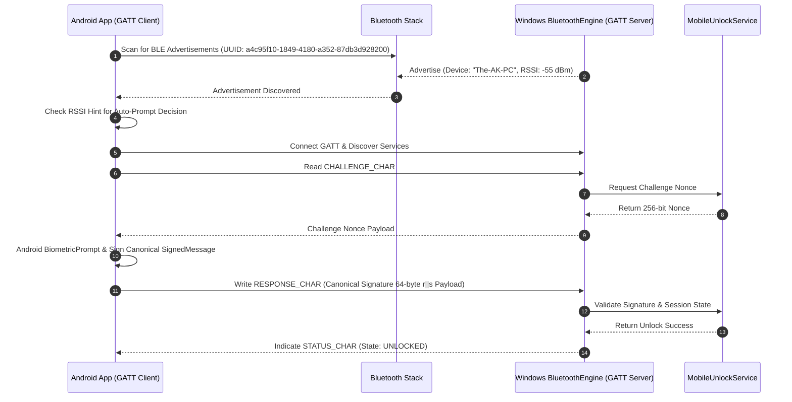

# MobileFingerprintUnlock — Bluetooth / BLE Transport Specification

## 1. Bluetooth Low Energy Architecture (Phase 10)

Phase 10 introduces **Bluetooth Low Energy (BLE)** to provide proximity awareness, automatic device discovery, and an alternative local transport channel when Wi-Fi is unavailable or restricted.

### Critical Security Rule & Proximity Scope
> [!WARNING]
> **Bluetooth Proximity Alone DOES NOT Authenticate**: Proximity (RSSI level or BLE connection presence) is strictly used as a **contextual hint for UI auto-prompting decisions**. Proximity (RSSI) DOES NOT prevent relay attacks and IS NOT an anti-relay security mechanism. **BLUETOOTH PROXIMITY ALONE SHALL NEVER UNLOCK THE WINDOWS WORKSTATION**.

$$\text{RSSI / Proximity} \longrightarrow \text{Auto-Prompt Decision} \longrightarrow \text{BiometricPrompt} \longrightarrow \text{Cryptographic Authentication}$$

---

## 2. Dedicated 128-Bit BLE GATT Profile Specification

The Windows Service acts as a **BLE GATT Server**, advertising the custom MobileUnlock Service UUID.

- **Primary Service UUID**: `a4c95f10-1849-4180-a352-87db3d928200`

### GATT Characteristics

| Characteristic Name | UUID | Permissions | Description |
| :--- | :--- | :--- | :--- |
| **`STATUS_CHAR`** | `a4c95f11-1849-4180-a352-87db3d928200` | Read, Notify | Transmits current PC session state (`LOCKED`, `UNLOCKED`). |
| **`CHALLENGE_CHAR`** | `a4c95f12-1849-4180-a352-87db3d928200` | Read, Indicate | Server writes random 256-bit challenge nonce for client read. |
| **`RESPONSE_CHAR`** | `a4c95f13-1849-4180-a352-87db3d928200` | Write | Client writes Canonical SignedMessage signature payload (64-byte $r \parallel s$). |
| **`COMMAND_CHAR`** | `a4c95f14-1849-4180-a352-87db3d928200` | Write | Client writes authenticated remote lock command. |

---

## 3. Bluetooth Sequence Diagram

---

## 4. Proximity & RSSI Thresholding Scope

1. **RSSI Filtering as UI Hint**: Android app evaluates Received Signal Strength Indicator (RSSI). If RSSI falls below `-75 dBm` (indicating distance > 3-5 meters), auto-unlock prompts are suppressed to prevent out-of-room unlock popups.
2. **Background BLE Scanning**: Uses Android `BluetoothLeScanner` with `ScanFilter` for `a4c95f10-1849-4180-a352-87db3d928200` to minimize battery drain.
