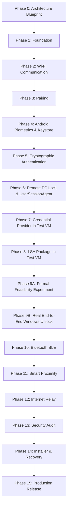

# MobileFingerprintUnlock — Phased Development Roadmap

## 1. Sequential Phase Overview (Phases 0 - 15)

To guarantee software stability, safety, and security compliance, development proceeds strictly in **16 sequential phases**. No phase may begin until all unit and integration tests of preceding phases pass cleanly.

---

## 2. Detailed Phase Specifications & Exit Criteria

### Phase 0: Architecture Blueprint (COMPLETE)
- **Scope**: Author all 14 architectural specification documents, cross-document audit, and sequence diagrams.
- **Exit Criteria**: Full approval of architecture suite by user. Zero application code written.

### Phase 1: Foundation
- **Scope**: Setup CMake build system for C++20, initialize Windows Service skeleton (`MobileUnlockService` under `NetworkService`), initialize `UserSessionAgent` skeleton (running in active interactive user session), setup GoogleTest test framework, initialize Flutter Android app skeleton.
- **Exit Criteria**: `MobileUnlockService` runs as a service; `UserSessionAgent` launches in active interactive user session; GoogleTest harness executes cleanly.

### Phase 2: Wi-Fi Communication
- **Scope**: Implement `NetworkEngine` (TCP socket server with TLS 1.3 in C++) and `WiFiTransport` in Flutter. Implement mDNS service discovery (`_mobileunlock._tcp`).
- **Exit Criteria**: Mobile app connects to Windows Service over Wi-Fi TLS 1.3 stream; `PING`/`PONG` heartbeat verified.

### Phase 3: Pairing
- **Scope**: Implement `PairingManager` on Windows and Android. Implement Short Authentication String (SAS) out-of-band PIN display and public key exchange.
- **Exit Criteria**: Device pair successfully stored in Windows registry `HKLM\SOFTWARE\MobileFingerprintUnlock\Devices`.

### Phase 4: Android Biometrics & Keystore
- **Scope**: Implement `AndroidKeystoreManager` in Kotlin (`KeyPairGenerator` secp256r1) and `BiometricManager` (`BiometricPrompt` API with `CryptoObject`). Output 64-byte IEEE P1363 raw signature.
- **Exit Criteria**: Fingerprint touch successfully authorizes signature creation over Canonical SignedMessage (without SID) in Android TEE test app.

### Phase 5: Cryptographic Authentication
- **Scope**: Implement `CryptoManager` (CNG ECDSA P-256 signature verification over raw 64-byte IEEE P1363 $r \parallel s$) on Windows. Implement end-to-end `AUTH_REQUEST` -> `AUTH_CHALLENGE` -> `AUTH_RESPONSE` flow over Wi-Fi.
- **Exit Criteria**: Windows Service successfully verifies ECDSA P-256 signatures generated by Android Keystore against canonical signed message struct.

### Phase 6: Remote PC Lock & UserSessionAgent
- **Scope**: Implement remote lock workflow (`LOCK_REQUEST`). Service dispatches lock command to `UserSessionAgent.exe` in active interactive user session, which calls `LockWorkStation()`. Support optional "Require fingerprint before remote lock" toggle.
- **Exit Criteria**: Tapping [Lock PC] in Android app locks Windows workstation cleanly without logging off or terminating user sessions.

### Phase 7: Credential Provider in Test VM
- **Scope**: Implement Windows Credential Provider v2 DLL (`ICredentialProvider`, `ICredentialProviderCredential`) in C++. Setup RPC pipe communication with `MobileUnlockService`. **DEVELOPMENT TESTED EXCLUSIVELY IN DEDICATED WINDOWS VM**.
- **Exit Criteria**: MobileUnlock tile appears on Winlogon lock screen in VM; tile receives authentication status from service pipe.

### Phase 8: LSA Package in Test VM
- **Scope**: Implement custom LSA Authentication Package DLL (`LsaApInitializePackage`, `LsaApLogonUserEx2`). **DEVELOPMENT TESTED EXCLUSIVELY IN DEDICATED WINDOWS VM**.
- **Exit Criteria**: LSA package loads into `lsass.exe` in VM without error; package handles `LsaApLogonUserEx2` calls.

### Phase 9A: Windows Authentication Laboratory (Formal Feasibility Experiment)
- **Scope**: Execute isolated, formal feasibility experiments in Windows Test VM.
- **Mandatory Exit Criteria**:
  1. Exact workstation unlock `SECURITY_LOGON_TYPE` identified and validated.
  2. Exact Credential Provider submission behavior identified.
  3. Experimentally prove whether phone-triggered automatic credential submission is possible, or if the user must click/select the Credential Provider tile.
  4. Exact LSA token-information structure required (`LSA_TOKEN_INFORMATION_TYPE` & `TokenInformation`) identified and validated.
  5. Exact account SID mapping behavior validated.
  6. Exact failure behavior validated.
  7. Successful workstation unlock achieved in Windows Test VM.
  - *Guideline*: If any requirement is not supported by native Windows APIs, document the limitation and implement the closest supported UX rather than inventing an undocumented workaround.

### Phase 9B: Real End-to-End Windows Unlock
- **Scope**: Connect Phone Biometric $\rightarrow$ Android Keystore $\rightarrow$ Canonical Signature $\rightarrow$ Wi-Fi $\rightarrow$ Service $\rightarrow$ Credential Provider $\rightarrow$ LSA Package $\rightarrow$ Windows Workstation Unlock.
- **Exit Criteria**: User presses [Unlock] on phone -> biometrics validated -> Windows VM unlocks desktop natively.

### Phase 10: Bluetooth BLE
- **Scope**: Implement `BluetoothEngine` (BLE GATT Server on Windows with dedicated 128-bit UUID `a4c95f10-1849-4180-a352-87db3d928200`) and `BluetoothTransport` (GATT Client in Flutter).
- **Exit Criteria**: Full unlock challenge-response successfully executes over BLE GATT characteristics.

### Phase 11: Smart Proximity
- **Scope**: Implement RSSI signal filtering as a UI hint for auto-prompt decisions.
- **Exit Criteria**: App suppresses auto-unlock prompts when RSSI is weaker than `-75 dBm`.

### Phase 12: Internet Relay
- **Scope**: Build E2EE WebSocket relay server with inner application-layer encryption ($K_{\text{app}}$). Implement relay tunnel transport in Windows Service and Android App.
- **Exit Criteria**: Remote lock and status query operate successfully over public cell network without decrypting application payloads on relay server.

### Phase 13: Security Audit
- **Scope**: Perform static code analysis, memory leak checks (AddressSanitizer), protocol fuzzing, and STRIDE mitigation verification.
- **Exit Criteria**: Zero high or critical security findings; all audit logs verified.

### Phase 14: Installer & Recovery
- **Scope**: Build Windows Installer (`MSI` / PowerShell deployment), set up registry ACLs, create emergency recovery script (`EmergencyRecovery.ps1` with `-DryRun` support).
- **Exit Criteria**: Full install, uninstall, and Safe Mode recovery tested cleanly in clean VM.

### Phase 15: Production Release
- **Scope**: Final documentation polish, release packaging, signed binary distribution.
- **Exit Criteria**: Production-ready deployment package verified on clean Windows 10/11 installations.
