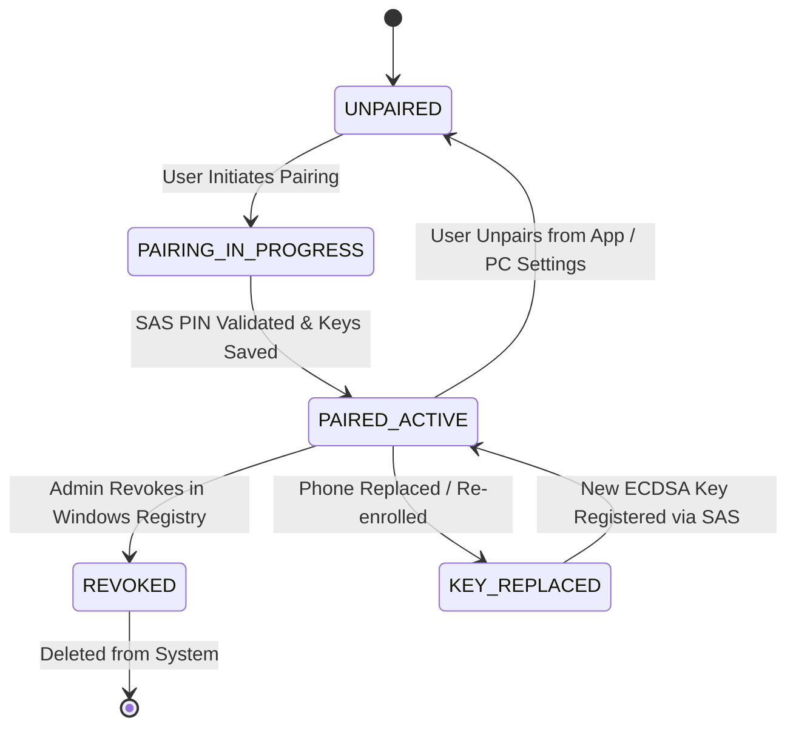

# MobileFingerprintUnlock — Identity Mapping & Lifecycle Specification

## 1. Core Identity Mapping Chain

To bridge mobile biometric authorization safely to Windows operating system user access tokens, the system establishes a strict, auditable identity resolution pipeline. **The mobile device NEVER specifies or chooses the target Windows SID**; identity mapping is evaluated exclusively on the Windows PC:

```
+-----------------------------------------------------------------------------------+
| Android Device ID (UUID v4 generated during pairing & signed in canonical message) |
+-----------------------------------------------------------------------------------+
                                         |
                                         v Windows Server Resolves DeviceID
+-----------------------------------------------------------------------------------+
| Trusted Device Record                                                             |
| Registry: HKLM\SOFTWARE\MobileFingerprintUnlock\Devices\<DeviceID>                |
| - Public Key (ECDSA P-256 IEEE P1363 SPKI Blob)                                   |
| - Pair Status: ACTIVE / REVOKED                                                   |
| - Mapped Account SID (e.g. S-1-5-21-3623811015-3361044348-30300820-1001)           |
+-----------------------------------------------------------------------------------+
                                         |
                                         v Maps to Target Computer
+-----------------------------------------------------------------------------------+
| Windows Machine Identity (Hostname / Security Identifier)                         |
+-----------------------------------------------------------------------------------+
                                         |
                                         v Maps to Windows Security Principal
+-----------------------------------------------------------------------------------+
| Windows Account SID (Security Identifier)                                         |
+-----------------------------------------------------------------------------------+
                                         |
                                         v Evaluates Policy & LogonType
+-----------------------------------------------------------------------------------+
| Allowed Authentication Operations                                                |
| - UNLOCK_WORKSTATION (Allowed if Active & Biometric Canonical Signature Valid)    |
| - LOCK_WORKSTATION   (Allowed if Active & Dispatched to UserSessionAgent)         |
+-----------------------------------------------------------------------------------+
```

---

## 2. Multi-Device & Multi-User Support Model

### 2.1 Multi-Phone Support (1 Windows User : N Phones)
- A Windows user account can trust up to **5 distinct mobile devices** (e.g., personal phone, work phone, tablet).
- Each phone possesses a unique `Android Device ID` and its own hardware-backed ECDSA key pair.
- The registry maintains a subkey per device under `HKLM\SOFTWARE\MobileFingerprintUnlock\Devices\<DeviceID>`.

### 2.2 Multi-User PC Support (N Windows Users : M Phones)
- On multi-user Windows workstations, distinct Windows user accounts can pair separate phones.
- During `AUTH_REQUEST`, the phone presents its `Android Device ID`. `MobileUnlockService` resolves which Windows Account SID is bound to that device ID and passes that specific Account SID to the LSA package for session unlock.

---

## 3. Identity Lifecycle Operations



### 3.1 Device Revocation
- **Action**: An administrator or user selects `[Revoke Phone]` in Windows settings or modifies registry `Status` to `REVOKED` (`0x00`) under `HKLM\SOFTWARE\MobileFingerprintUnlock\Devices\<DeviceID>`.
- **Effect**: Any subsequent `AUTH_REQUEST` from that `Android Device ID` is immediately rejected with `AUTH_FAILURE` (`ERROR_DEVICE_REVOKED`).

### 3.2 Unpairing
- **Action**: User taps `[Unpair PC]` in Android App or removes device in Windows GUI.
- **Effect**:
  1. Phone sends `UNPAIR_REQUEST` packet.
  2. Windows Service deletes the registry key under `HKLM\SOFTWARE\MobileFingerprintUnlock\Devices\<DeviceID>`.
  3. Android App deletes server public key and clears paired metadata from app storage.

### 3.3 Phone Replacement
- When a user gets a new phone, the old phone record MUST be unpaired or revoked.
- The new phone completes a fresh out-of-band SAS PIN pairing flow, generating a new `Android Device ID` and ECDSA key pair.

### 3.4 Windows Account Changes
- If a user renames their Windows account or changes domain SID, existing device bindings are automatically updated by `ConfigurationManager` querying `LookupAccountNameW` upon service start.
