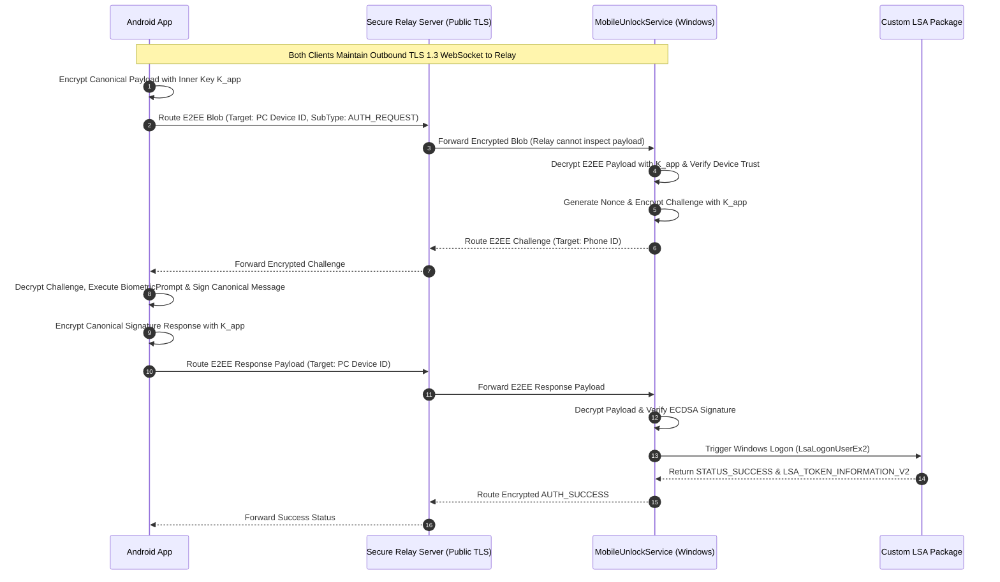

# MobileFingerprintUnlock — Zero-Trust Internet Relay Specification

## 1. Relay Architecture & E2EE Clarification (Phase 12)

Phase 12 introduces an optional **Zero-Trust Internet Relay Server** allowing remote status monitoring and workstation lock/unlock over public cell networks without requiring router port forwarding.

### True End-to-End Encryption (E2EE) Standard
> [!IMPORTANT]
> **Transport TLS vs Application E2EE**: Standard TLS 1.3 connections terminated at a relay server **DO NOT** constitute end-to-end encryption between Phone and PC. To achieve true Zero-Trust E2EE, the system uses a **Two-Layer Architecture**:
> 1. **Outer Transport Layer**: TLS 1.3 socket connecting Phone $\rightarrow$ Relay and PC $\rightarrow$ Relay.
> 2. **Inner Application Layer**: ECDH P-256 key exchange performed out-of-band during pairing generates an inner payload encryption key ($K_{\text{app}}$). Application authentication messages, nonces, and signatures are encrypted with AES-256-GCM using $K_{\text{app}}$ **BEFORE** transmission to the relay. The relay acts strictly as a blind packet router and **CANNOT DECRYPT** application payloads.

```
+------------------+     [Inner E2EE Payload: Encrypted with K_app]        +------------------+
| Android App      | ====================================================> | Windows PC       |
+------------------+                                                       +------------------+
        \                                                                           /
         \  Outer TLS 1.3 Connection                       Outer TLS 1.3 Connection /
          \                                                                    /
           +------------------------------------------------------------------+
           |           Secure Relay Server (Blind Packet Router)              |
           |           - Cannot decrypt application payload                   |
           |           - Sees only routing headers (Device GUIDs)             |
           +------------------------------------------------------------------+
```

---

## 2. Internet Relay Sequence Diagram



---

## 3. Server State & Minimization

The relay server maintains only transient in-memory routing tables:

```json
{
  "routing_table": {
    "pc_device_guid_12345": "websocket_connection_handle_A",
    "phone_device_guid_67890": "websocket_connection_handle_B"
  }
}
```

No database of user accounts, cryptographic keys, or session tokens is stored on the relay infrastructure.
