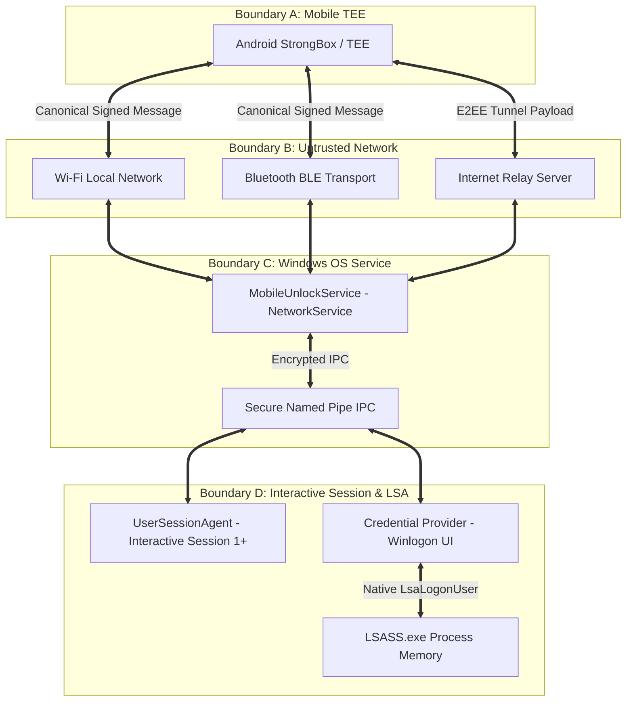

# MobileFingerprintUnlock — Threat Model & Security Boundaries

## 1. Overview & Trust Boundaries

The **MobileFingerprintUnlock** security architecture defines four explicit trust boundaries:

1. **Boundary A (Mobile Hardware Security Module)**: Android TEE / StrongBox isolating private cryptographic key material from Android application space and malware.
2. **Boundary B (Network Transport Layer)**: Local Wi-Fi, Bluetooth BLE, or Internet Relay connecting Android device and Windows PC. (Assumed completely untrusted).
3. **Boundary C (Windows Network Service & IPC)**: `MobileUnlockService` operating under `NT AUTHORITY\NetworkService` receiving network payloads and communicating over DACL-restricted Named Pipes (`\\.\pipe\MobileUnlockSecureIPC`).
4. **Boundary D (Interactive Desktop Session & LSA Subsystem)**: `UserSessionAgent.exe` running in Session 1+ (calls `LockWorkStation()`) and `lsass.exe` running in TCB (evaluates LSA logon buffers).

---

## 2. STRIDE Threat Matrix

| Threat Category | Target Subsystem | Attack Vector | Severity | Mitigation Strategy |
| :--- | :--- | :--- | :--- | :--- |
| **Spoofing** | Android App | Impersonating a paired Android phone via copied MAC/IP address. | Critical | Identity is verified via **ECDSA P-256 digital signature** created inside hardware Keystore over a canonical signed message. IP/MAC addresses are never trusted. |
| **Spoofing** | Windows PC | Rogue PC impersonating Windows service to harvest unlock requests. | High | TLS 1.3 server certificate / public key pinned during out-of-band SAS pairing. |
| **Tampering** | Network Transport | Man-in-the-Middle (MitM) altering `AUTH_CHALLENGE` or `AUTH_RESPONSE`. | High | All network transport is wrapped in **TLS 1.3 (AEAD)**. Signature digest covers canonical message fields (ServerID, DeviceID, Nonce, Timestamp, SessionID, AccountSID). |
| **Repudiation** | Windows Logon | User denies initiating remote workstation unlock. | Medium | All pairing, unlock, and lock events are recorded in Windows Security Event Log with device fingerprint and timestamp. |
| **Information Disclosure** | Local Storage | Attacker dumps Android app storage to extract keys or passwords. | Critical | Private keys stored inside Android Keystore TEE. No passwords stored anywhere in app. Configuration data encrypted via Android Keystore AES-256. |
| **Information Disclosure** | Memory Dumps | Dumping `lsass.exe` or `MobileUnlockService.exe` memory to recover passwords. | Critical | Zero passwords used. LSA package validates challenge signature directly against stored public key. Zero password strings exist in memory. |
| **Denial of Service** | Windows Service | Flooding network socket with unauthenticated `AUTH_REQUEST` packets. | Medium | Rate limiting, max connection throttling, packet size limits (max 4KB), socket timeouts, and least-privileged service identity (`NetworkService`). |
| **Elevation of Privilege** | Local Windows IPC | Low-privilege local user sending fake IPC messages to Credential Provider / Service. | Critical | Windows Named Pipe ACL restricted exclusively to `SYSTEM` and `Administrators`. Client process token verified via `GetNamedPipeClientProcessId` and `OpenProcessToken`. |

---

## 3. Attack Surface Detailed Analysis

### 3.1 Wi-Fi & Local Network Surface
- **Risk**: Eavesdropping, packet replay, subnet scanning, ARP spoofing.
- **Mitigation**: Network transport is strictly encrypted with TLS 1.3. Challenges contain a 256-bit cryptographically secure random nonce (`BCryptGenRandom`) with a strict 30-second TTL. Replayed packets are rejected immediately by sequence tracking in `AuthenticationManager`.

### 3.2 Bluetooth BLE Surface
- **Risk**: BLE spoofing, relay attacks, GATT characteristic tampering.
- **Mitigation**: BLE is used for discovery and proximity hints. Proximity (RSSI) merely controls UI auto-prompt decisions. Authentication **STILL REQUIRES** full ECDSA canonical challenge signing over GATT write characteristics.

### 3.3 Windows Local IPC Surface
- **Risk**: Local malware attempting to trigger Credential Provider unlock calls or UserSessionAgent lock calls.
- **Mitigation**: Named Pipes (`\\.\pipe\MobileUnlockSecureIPC`) enforce explicit DACLs (`D:P(A;;GA;;;SY)(A;;GA;;;BA)` - SYSTEM and Administrators only). Credential Provider and UserSessionAgent verify session tokens directly with `MobileUnlockService` via IPC session validation.
